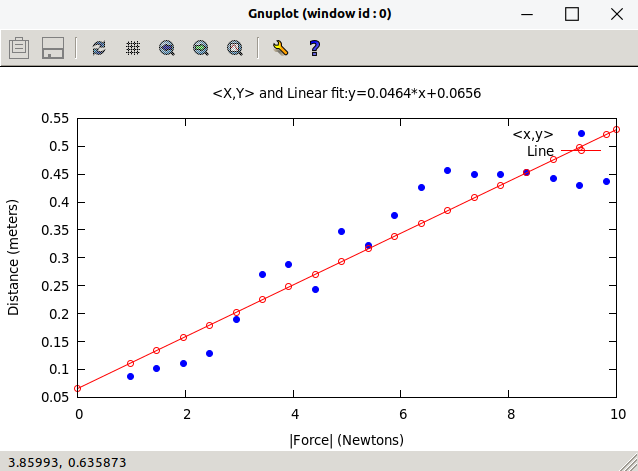
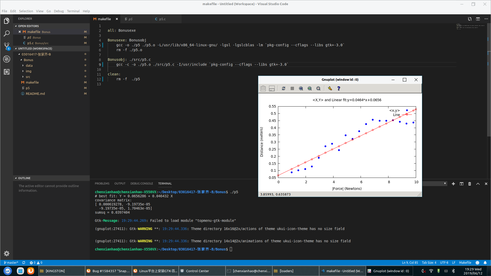
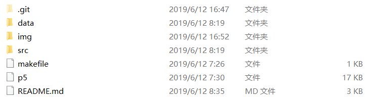
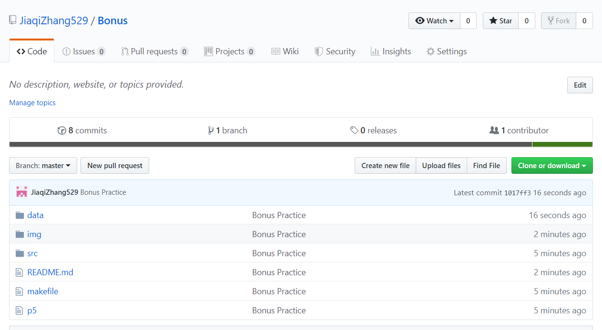

/////////////////////////////README////////////////////////////////

本次的练习主要分为两个部分：
1.学习在Ubuntu下使用Gcc编译器，使用GSL进行数据拟合，使用Gnuplot进行绘图；
2.学习使用Git进行版本控制，学习以Git为内核的Github的使用。

////////////////////////////第一部分///////////////////////////////
 
 1.Ubuntu简介
    Ubuntu是一个以桌面应用为主的开源GNU/Linux操作系统，是基于Debian GNU/Linux，支持x86、amd64（即x64）和ppc架构，由全球化的专业开发团队（Canonical Ltd）打造的。学习适应Ubuntu的使用，可以很好的帮助我们进行一些高端的，复杂的开发。

2.数据拟合
    为了实现对spring_data.csv文件内数据的拟合，我们需要将文件中读取出来，并存放为合适的格式。为方便后期使用，我们把读取到的数据放入D和M数组中。接下来直接使用GSL自带的函数gsl_fit_linear进行数据拟合，拟合得到的结果如下：

3.绘图
    Gnuplot是一个很好用的绘图软件，可以在多种平台上使用，同时符合自由软件的原则。由于我们使用C语言来绘图，所以我们需要用Pipe传递命令和数据。最终绘制的结果如下：

////////////////////////////第二部分///////////////////////////////

1.版本控制
    在任何一个软件开发的过程中，版本控制都是其中一个必不可少的工具。而Git作为其中极为流行且实用的一个工具，受到许许多多的软件开发者的喜爱，而其中很重要的一点，全球最大的开发者聚集地GitHub正是使用Git作为其基础，因此学习Git的使用是十分重要的一个环节。

2.建立Git仓库
    首先我们要配置Git的开发者信息，然后在本地存储器上建立一个仓库用来存放相关的工程文件。接下来的添加、修改、提交都通过Git的命令来实现。本地的Git仓库如下：

3.工程发布
    为了是自己的工作可以被更多的人了解，方便开发者进行更好的交流，我们可以将自己的工程发布到GitHub上，这样也能够更好的进行开发。所建立的远程GitHub仓库的网址为：
    https://github.com/JiaqiZhang529/Bonus

仓库的截图如下：

//////////////////////////////THEEND///////////////////////////////

